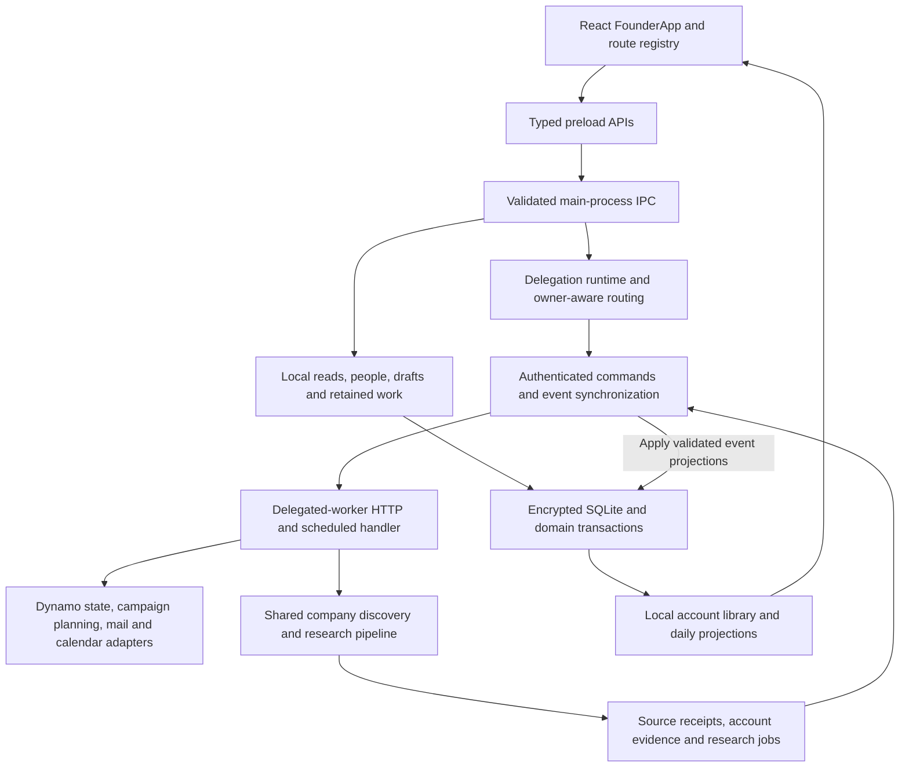

# FSS architecture and technical-debt audit

Date: 2026-09-09. Audited application revision: `005a11e2e5ad897f4a436469d93a0db28c66081b`.
Status: assessment and proposed cleanup sequence, **not implementation approval or a release**.

**Historical baseline:** the findings and line references below describe revision `005a11e` before cleanup. David approved the bounded followthrough at 2026-09-09T21:51:19Z. See [the implementation and acceptance map](2026-09-09-cleanup-followthrough.md) for repaired items, newly registered first-use tests, and deliberately unresolved product gates. The original audit is retained rather than rewritten as if these fixes existed at inspection time.

## Decision

**Keep the working foundation. Clean up proven residue, repair misleading verification, then finish one real user workflow using the existing services. Do not rewrite FSS or broadly roll it back.**

The main problem is not hundreds of unused modules. It is a partially completed transition from a person/prospect application to a company-and-conversation application. Some new capabilities work only below the UI, while tests often start after the missing entry step. There is also genuine obsolete UI, duplicated parsing, presentation-state coupling, and release/documentation drift.

The previous release's passing tests and signed package remain useful evidence for their actual cases. They did not establish that a founder could start with an empty company library and complete the intended company/call/reply workflow. Treating those totals as overall product completion was too broad.

No application code, data, installed app, profile, grants or provider state was changed by this audit. No rollback or deletion was performed. Only audit documentation is being added to the repository.

## 1. What is actually built

This depicts implemented connections, not enabled live services. The desktop is unpaired according to the prior installation walkthrough. No current runtime state was inspected here.

- **Composition:** `src/main.ts:192-224` → `src/main/startApplication.ts`. Foundation/Domain initialize before the window. Main owns SQLite, providers, lifecycle invalidation and resource shutdown. Preload exposes named feature APIs, and `src/main/ipc/registerValidatedIpc.ts:16-42` checks sender, request and response boundaries.
- **Two data models coexist intentionally:** legacy persons/prospects/cycles/actions preserve actual work and suppression; PM accounts/evidence/routes/campaigns support the new direction. A parcel owner is not automatically a property-management company. Shared suppression and historical receipts still connect the models.
- **Two research paths are not interchangeable:** the legacy discovery worker still performs local assessment/priority work. Startup gives it unavailable external research. The separate PM pipeline fetches and admits company evidence, and the delegated worker really calls it. Desktop PM research can be constructed but has no normal product invocation of `prepare`/`runNext` yet (`startApplication.ts:783-798,831-838,944`; `src/main/research/companyResearchWorker.ts:7-33,51-83`).
- **Worker root:** `cloud/lambdas/delegated-worker/build.mjs:4` bundles `cloud/lambdas/delegated-worker/src/handler.ts`, which routes authenticated setup/commands/events and the exact scheduled source coordinator. Its small `cloud/lambdas/delegated-worker/src/index.ts` is not the complete runtime. Research, scoped mail, approved dispatch and meeting phases are implemented in `sourceCoordinator.ts:105-155,347-450`, behind explicit configuration and ownership.
- **Renderer:** Today/Accounts/Campaigns mount NativeDesk. Leads, Pipeline, Conversations, Learnings, Friday, Inbox and Settings remain registered and reachable. LegacyToday is a real mode-specific fallback, not the cause of the beige loading flash (`src/renderer/app/routeRegistry.tsx:34-101`; `src/renderer/features/today/NativeDeskRoute.tsx:193-227`).
- **Three editor sessions have different responsibilities:** local email can send through local authority; requested-email review approves an exact worker-owned draft; LinkedIn captures manual actions/outcomes. Their identity, uncertainty and receipt rules differ. Share presentation where useful, not their execution semantics.

### Capability map

| User outcome | Existing implementation | Missing or gated part |
| --- | --- | --- |
| Enter and reopen a PM company | Account repository, source evidence, local account reader/library | No public company-create/intake workflow. Person CSV import is not a substitute. |
| Research a bounded company cohort | Shared preparation/research pipeline, SQL and worker storage bindings, fetched receipts and budget reservations | Desktop invocation absent. Worker invocation exists but requires authorized setup. |
| See local commitments and company evidence | Real local IPC/read models and UI, independent of pairing | Empty local data is valid. It does not imply execution ownership. |
| Connect the worker | Pair/bootstrap/configure APIs and authenticated protocol | Current Settings does not expose the necessary setup flow. “Review Settings” cannot resolve it yet. |
| Call a business route without inventing a person | Composed delegated `beginPhone` path and a separate tested local account adapter | Current account detail explicitly holds company-only handoff. Native/live acceptance is separate. |
| Create and approve a campaign | Worker versions/commands/planner/enrollment and a tested envelope adapter | UI lacks strategy creation and reviewable audience/content material; approval is disabled. |
| Start requested email or a manual LinkedIn step | Public preparation APIs, repositories and existing-draft editors | UI starts from saved drafts, not from the preceding first-prepare action. |
| Draft an ordinary relevant email reply | Thread intake, stored-reply helper, approval/dispatch/reconciliation machinery | Reply-generation helper is not composed in production; ordinary reply editing/approval is explicitly held. |
| Continue while the Mac sleeps | Real scheduled worker phases | Genuine pairing, owner admission, grants, configuration and live acceptance remain separate. |

Primary source trails: `src/preload/createCallieApi.ts:33-79`, `src/main/ipc/registerOutreachIpc.ts:38-51`, `src/main/delegation/delegationRuntime.ts:116-156`, `src/renderer/features/today/DailyAnswers.tsx:335-363`, `src/renderer/features/campaigns/CampaignReview.tsx:28-32,78-86`.

## 2. Confirmed debt, in practical priority order

### A. Missing workflow starts are being obscured by component-level completion

**Impact: blocks the intended product outcome. Disposition: finish wiring, not rebuild the backend.**

The first-company path, owner setup, company-only call initiation, strategy approval and initial message preparation have different missing UI/composition steps. They are not all explained by an unpaired worker.

The clearest coverage evidence is `tests/e2e/accountPreparation.spec.ts:1-28`: it deliberately registers **zero tests** and records missing user-path acceptance. Existing integration research tests use injected fictional HTTP responses, browser studies supply account/draft APIs, and the packaged meeting-first test proves the real **unpaired** local state. Those are worthwhile tests, but none closes the first-company workflow.

**Required check:** replace the inventory with a registered path through the actual UI → preload → IPC → account/evidence store → restart. Use isolated fictional provider responses for repeatability, then separately authorize real-company research quality/cost and genuine worker ownership acceptance. Do not insert production fixture accounts or fabricate a person to satisfy old controls.

### B. The canonical release contract has drifted

**Impact: the next standard release can omit important checks or check different artifacts. Disposition: repair the checked-in release contract before relying on it.**

1. `package.json:40` verifies default `out`, but E2E selects `CALLIE_E2E_OUT_DIR` when inherited (`tests/support/packagedApplication.ts:4-12`; `scripts/verifyPackage.mjs:502-505`). Thus the script can verify package A while tests launch package B. This is a source-proven selection mismatch, **not a reproduced false-green release**. Prior explicitly controlled candidate runs are not invalidated.
2. The standard release/CI commands do not own the NativeDesk browser or Swift test lanes. Two `node:test` helper suites are intentionally excluded from Vitest but lack a current aggregate runner (`package.json:19,23,40`; `vitest.config.mts:8-12`). Do not simply remove exclusions and mix incompatible runners.
3. README says current backup schema16 and ten Lambda packages, while the executable requires schema24 and the dynamic verifier discovers eleven. `test/releaseDocumentation.test.mjs:42-50` actively enforces the obsolete schema16 wording. The default-skipped `test/preReleaseElectronHost.test.mjs:14,82,84` migrates to latest but expects schema17.

**Required check:** one resolved candidate path and embedded artifact identity must bind package verification, scans and launched E2E. A two-candidate negative case must reject mismatches. Explicitly enumerate required test runners and report intentional skips. Update current docs against executable contracts, while retaining correctly labeled historical schema15 tools/tests. Re-run the real synthetic two-process backup-host test rather than changing only its expected number.

### C. Two CSV parsers have diverged, and the focused tests exercise the unused one

**Impact: useful parser coverage does not protect the actual import path. Disposition: consolidate with behavioral tests before removing either implementation.**

The active import facade calls its private `parseTabular` (`src/main/domain/founderSalesDomain.ts:2468-2472,2615-2656`). The separate `src/main/imports/csvParser.ts` is imported only by its own test.

A scratch-only probe executed the exact active method body with TypeScript syntax erased and the installed PapaParse dependency. No app, IPC, database or provider was loaded. Two synthetic cases confirmed:

| Input property | Active method | Detached tested helper |
| --- | --- | --- |
| Blank records between data rows | Reports source rows 2 and 3 | Preserves rows 2 and 5 |
| Duplicate `Name` headers | Receives Papa's renamed `Name_1`, reports no duplicate error | Reports `DUPLICATE_HEADER` |

This is bounded method-level evidence, not full import/commit acceptance. Do not casually replace one parser with the other: delimiter behavior, remapping, error retention, duplicate decisions and source-row provenance must be checked through the real preview/remap/commit path. In particular, inspect parse-error preservation across remap and commit (`founderSalesDomain.ts:2497-2516`).

**Required check:** active public-import tests for duplicate/blank headers, blank records, quoting/BOM, malformed rows, remapping and exact source-row identity. Then keep one implementation and retire the duplicate without changing saved receipts.

### D. Five retired UI components are strong removal candidates

**Impact: maintenance noise and misleading discoverability, not a current visible broken button. Disposition: narrowly remove view residue.**

- `src/renderer/features/today/BacklogCard.tsx`
- `src/renderer/features/today/NextUpCard.tsx`
- `src/renderer/features/today/TodayLane.tsx`
- `src/renderer/features/today/TriageMode.tsx`
- `src/renderer/features/discovery/DiscoverySection.tsx`

The four Today modules have no tracked component/test importers. `TodayPage.tsx:19-55` directly flattens the lanes, and `onStartTriage` is an unused prop supplied as a no-op (`TodayRoute.tsx:226`). DiscoverySection has only its own tests; production uses SuggestedContacts plus provider-owned ContactPreparation/DiscoveryBrief.

**Required check:** remove only these views, obsolete props and demonstrably exclusive CSS. Preserve relevant assertions on active consumers. Verify actual legacy Today, suggested contacts, retained contact detail, import and NativeDesk. Do not recursively delete their shared APIs, lifecycle logic or imports. There should be no intended visible production change.

### E. Appearance is coupled to asynchronous route data

**Impact: the observed wrong-theme loading flash and fragile CSS maintenance. Disposition: a bounded presentation fix, not another redesign.**

The initial NativeDesk branch lacks `data-workflow-mode`, while ancestor palette/rail/wordmark rules depend on a descendant with that attribute. A only applies after the daily snapshot arrives (`NativeDeskRoute.tsx:193-210,555-562`; `src/renderer/design/themes.css:146-181`; `nativeDesk.css:279-318`). Prior screenshot-only observation captured the beige/FSS intermediate state before settled A. It was not a real legacy-mode transition.

Repeated later geometry overrides in `nativeDesk.css` also make modifications order-sensitive. They are active repairs, not automatically dead rules. Account evidence is independently formatted in `NativeDeskRoute.tsx:347-394` and `LocalAccountLibrary.tsx:12-19`; that is a sensible small extraction when changing company intake, unlike merging distinct editor sessions.

**Required check:** stable presentation through first pending/failed reads, known meeting-first refresh/remount and actual legacy mode, both themes/densities/widths. Preserve honest loading/unknown states and editor node/caret continuity. Presentation preference must not invent workflow authority. Consolidate CSS only with computed-style and whole-screen comparisons.

### F. Command replay is not company identity reconciliation

**Impact: repeated cohorts can create duplicate companies and fragment history. Disposition: resolve before expanding intake/research.**

`companyResearchWorker.ts:45-47,71-80` derives create-command IDs from the preparation command plus domain and deduplicates only inside that invocation. `AccountRepository.create` allocates another account after a new-command replay miss (`accountRepository.ts:45-55`). The worker binding derives account IDs from workspace and command identity, not company identity (`cloud/lambdas/delegated-worker/src/workerAccountRepository.ts:39-52`).

This establishes a control-flow risk, not a finding of duplicates in private data. A global unique-domain constraint or blind merge is not sufficient: firms can share domains and company/manager identity can be ambiguous.

**Required check:** the same unambiguously matched firm across distinct commands retains one account/history and existing suppression; shared-domain ambiguity stays unresolved rather than merging silently. Preserve existing command replay and evidence identities.

## 3. Keep, wire, refactor, remove, rollback

| Classification | Specific disposition |
| --- | --- |
| **Keep** | Encrypted storage, migrations, verified backup/recovery, identity/source evidence, opt-out checks, workflow-transition receipts, retained commitments and uncertain-send recovery. New account authorization still uses some legacy identity/suppression data. |
| **Keep and wire** | `accountOutboundService.ts`, `campaignService.ts`, `replyDraftService.ts`. All three have only test importers today, but implement intended adapters. Worker alternatives are partly reachable and do not make these whole responsibilities obsolete. Give each an explicit integration/defer decision. |
| **Refactor incrementally** | The two CSV paths, presentation-mode ownership, common read-only account evidence, required release-runner ownership, and company identity reconciliation. Extract responsibilities from the large facade only where the chosen slice actually needs it. File length alone is not a defect. |
| **Remove narrowly** | The five retired views and exclusive styling/props after active-route checks. Retain design HTML/history as reference material; it is outside the production renderer root and is not the startup bottleneck. |
| **Retire or port old tooling** | `scripts/designV2Screenshots.mjs` and `scripts/polishScreenshots.mjs` have no tracked caller, inherit the parent environment and lack failure-path cleanup. Do not run them for this audit. Port any needed captures to the maintained isolated fixture harness before removing unique evidence. External operator use is unverified. |
| **Defer an explicit choice** | `ManualQuickAdd.tsx` is own-test-only, but was an intended person-add feature. Either support it as person intake or retire it in favor of CSV/paste. It is not company intake. Windows/Linux Forge makers and Squirrel scaffolding are imported but unsupported by current Darwin ARM64 runtime; remove only after confirming the macOS-only scope. |
| **Do not broadly roll back** | The approved A composer, exact display bindings, measured read optimizations or schema23/24 storage. No specific regression justifying their rollback was established. Fix the observed loading boundary instead. |

## 4. Compatibility boundaries that cleanup must respect

- A source revert does not undo persisted migrations or the one-way workflow transition. `legacyWorkflowTransition.ts:66-134` records cancellations, parked successors and a receipt. `actionSettlementValidator.ts:73-88` and `todayRepository.ts` still interpret those exact identities. Deleting them can invalidate work or resume superseded acquisition.
- Historical migrations depend on runtime serializers/name normalization in a few places (`src/main/db/migrations/0008DedupeCloudPersons.ts:4-8,130-132,314-317`). Preserve historical behavior when extracting helpers. Do not edit old migration SQL as ordinary cleanup.
- Historical schema24 had a six-minute pre-release SQL change: `eb36fd3` introduced it, `9b668bf` fixed embedded-NUL validation while retaining version24. An earlier catalog would not be updated merely by rerunning the same migration ID. The known first installed schema24 artifact is a later descendant. **No affected installed profile is established.** Document unsupported pre-release artifacts or investigate exposure before proposing any forward migration. Do not weaken the current exact-catalog check.
- Restore drills prove decryptability, integrity, schema number and three legacy aggregate reads (`src/main/recovery/restoreDrill.ts:77-87`). That is narrower than current-app admission and semantic preservation of all account/campaign/transition records. Retain the existing drill and add a target-version disposable recovery fixture later. This audit did not find a failed real restore or authorize opening a real backup.
- The startup optimization retains initial inspection and bypasses stabilization only for its bounded ordinary encrypted case. It does not remove backup/recovery stabilization. No source-grounded reason to reverse it was found. Remaining startup time needs internal timing evidence, not speculative removal of integrity checks.

## 5. Recommended sequence

This is the proposed next local work, pending agreement on this bounded cleanup scope. It does not expand into live activation.

1. **Make verification trustworthy.** Bind all release stages to one artifact; own required browser/native/helper test runners; repair current docs and stale assertions. Preserve safe candidate packaging and the actual installed app.
2. **Small cleanup/repair batch.** Reproduce parser cases through the active import path, consolidate parsing, remove the five retired views/exclusive residue, and retire or port the two obsolete capture scripts. Separate commits and regression checks. No domain/data deletions.
3. **Fix the actual startup presentation boundary.** Keep A consistent without fabricating readiness; measure remaining startup stages separately. Do not spend this slice on another visual direction or a broad CSS rewrite.
4. **Finish one company workflow, not another backend.** Reconcile company identity, add a public local intake/read/reopen path using the existing account/evidence repository, preserve unknowns, and connect explicitly authorized research to that same record. Make the zero-test inventory a real packaged acceptance case.
5. **Then complete the intended execution chain.** Real owner setup, company-route confirmation, first requested/LinkedIn preparation, campaign reviewable material, ordinary replies and worker scheduling. Deliver vertical slices with a real first-use path, not only tests starting from saved drafts. Grants, deployment, paid research and actual calls/messages remain separately approved.

**Completion rule going forward:** for each feature, record its UI entry, preload/IPC handler, service/store, test of first use, and remaining live gate. “Service implemented,” “UI fixture passes,” and “user workflow delivered” are different statuses. Keep this in checked-in acceptance documentation rather than only chat handoffs.

## 6. Evidence and limits

- Clean application baseline verified before the audit. Four independent source reviews covered backend wiring, renderer coexistence, data/rollback, and verification/tooling. The coordinator cross-checked the principal source paths and contradictions.
- Compiler-assisted import analysis parsed **1,044 tracked code files** across desktop, tooling and cloud roots. Of **459 non-test/non-declaration `src` modules**, eleven were outside the conservative known production/tool closure: the five retired views, three disconnected adapters, CSV helper, ManualQuickAdd and the intentional NativeDesk fixture. The four Today views had no test importer either.
- This graph includes syntactic/type edges and is not a precise bundle/execution profile or an export-level dead-code proof. Dynamic/operational roots and renderer registries were checked separately. A graph edge does not prove that a particular method is invoked; absence alone did not authorize deletion.
- Two isolated exact-method parser cases were executed with synthetic strings. No application/native/database/provider execution occurred. Other findings are source/history contradictions or traced integration gaps, not newly reproduced end-to-end failures.
- No fresh full suite, package, live app observation, remote service check, formal security audit or performance benchmark was run in this audit. Prior release totals and prior startup observations are identified as earlier evidence, not fresh results. This is a broad architecture/debt assessment with focused verification, not a claim of line-by-line correctness of the entire repository.
- Private evidence set: `fss-codebase-audit-20260909/{backend-wiring,renderer-coexistence,data-rollback,coverage-tooling}.md`, compiler graph/source-edge files, and `parser-probe.{cjs,json}` in Jcode scratch. The source-method probe retains exact source/method hashes and raw synthetic results. No real contacts or profile contents are included.
