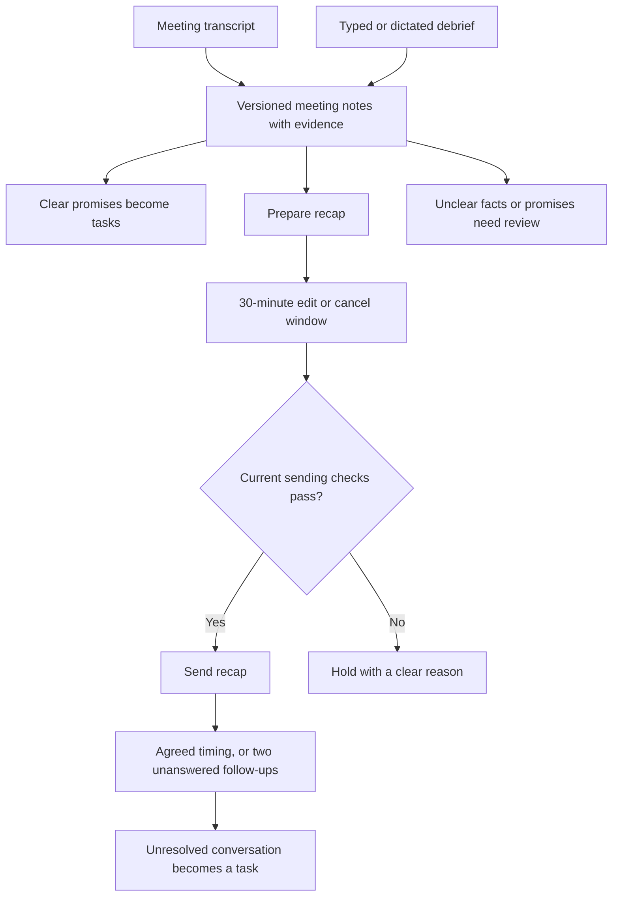

# Meeting outcomes and follow-through

Written design for review · 3 October 2026 · baseline `6fc1a0a7`, schema 42, desktop 1.0.40.

## What David gets

After a demo, Callie turns the transcript—or David's short debrief—into useful meeting notes, tasks for clear promises, and a concise prospect recap. Routine follow-through runs without approving every message once sending is enabled. David handles uncertainty and commercial exceptions. Deal stages remain his decision.

The first release delivers notes and tasks (M6). The second delivers recap and follow-through (M7). The existing firm-page meeting panel grows with both (M8); there is no new top-level workspace or separate automation platform.

## Settled product choices

- Transcript-based notes show evidence. Typed or dictated debriefs are labelled **Your notes**, not transcript evidence.
- A clear promise by David creates a task with its stated deadline automatically. An uncertain owner, promise or deadline goes to review. A task does not itself send an email or fulfill the promise.
- Routine recaps are prepared when usable notes are ready, then wait 30 minutes for editing or cancellation. Per-message approval is unnecessary for supported facts and agreed next steps.
- When there is no agreed follow-up date, send a recap and two unanswered follow-ups over two weeks, then create a task. An agreed date takes priority.
- Replies, new bookings, stops and takeover update or cancel pending work. Discounts, unsupported promises and new commitments go to David.
- The sender remains `david@usecallie.com`. One active outreach contact per firm; no automatic emailing of all meeting attendees.
- Sending remains paused. This work does not enable meeting transcription, call-suggestion automatic application, cold email or automatic deal-stage changes.
- React, shadcn and Tailwind remain. Today shows actionable work; meeting detail lives on the firm page.

## Findings from the current implementation

| Existing code | Design consequence |
|---|---|
| `meetings/transcripts.ts` returns versioned utterance references and a source revision; timing is relative to each file. | Persist source references and read all pages against one revision. Never invent a globally synchronized conversation from separate tracks. |
| `calls/summaryHandler.ts`, `calls/analysisPaid.ts` and the provider ledger already handle model requests, reservations and bounded attempts. | Reuse their transport and accounting primitives, with meeting-specific inputs and jobs. Do not run the two-channel call prompt on meeting audio. |
| `calls/callTasks.ts` requires a call session and a user actor; `call_tasks` deduplicates within a call. | Add meeting-specific tasks, sharing Today and firm-page presentation. Do not create fake calls or attribute worker actions to a human. |
| `sequences/followUpPermissions.ts` still refuses `booking_communications` with `booking_scope_reserved`. | M7 must implement real meeting-backed eligibility; adding a sequence alone cannot make these emails send. |
| `sequences/sendHandoff.ts` and `outbound/*` own durable delivery, pauses, caps, stops and reconciliation. | All meeting emails use that delivery path; there is no direct Gmail shortcut. |
| The desktop has no dictation implementation. | Start with a normal editable debrief field that accepts macOS Dictation. Verify it on a real Mac; avoid another audio-upload or speech-service subsystem. |

These paths are relative to `packages/domain` unless explicitly described as desktop code. The shared `DECISIONS.md` and `BACKLOG.md` remain the product decision record.

## Release 1: meeting notes and tasks

### Inputs and completeness

Each analysis names the meeting, current firm, selected transcript source revision, immutable transcript IDs/versions, debrief revision and speaker assignments. Changing an input makes old analysis visibly out of date. A late result may be retained as history but cannot replace newer corrections or create current tasks.

Read transcripts in complete, revision-consistent pages. A changed revision restarts input assembly before a model request. Pending or failed recordings produce a **Partial recording** label; never silently summarize only the first page. Partial material can produce a labelled draft, but cannot trigger automatic tasks or sending until David confirms that the notes are sufficient. A saved debrief can explicitly supply the missing context.

The debrief is a plain multiline editor with Save, Edit and Discard, persisted per meeting. Drafts survive navigating away. Dictation inserts text into that same editor; the saved text is the source, not a new audio recording. A failed microphone/OS-dictation path leaves typing and paste available. Saving a debrief does not imply attendance: the existing Attended control remains available alongside it when confirmation is missing.

### Notes and evidence

Show a short overview followed by needs, current workflow, objections, requested materials, commitments and next steps. Do not fill every section when there is no evidence. Distinguish a stated fact from an inferred interpretation.

Each extracted item cites either an exact transcript excerpt with recording/utterance references and file-relative time, or a saved debrief excerpt with its revision. Validate references and quoted text server-side. Transcripts and debriefs are data, never instructions that can grant permissions, invoke tools or change policy.

Participant labels and model speaker numbers are not verified identities. An unambiguous, user-confirmed mapping can identify **You** and named participants. Unknown speakers may still appear in notes, but their first-person statements cannot create tasks in David's name. Offer one compact speaker correction for the meeting, not a confirmation for every sentence.

Do not concatenate separate participant tracks and infer turn order or agreement from adjacency. If an interpretation depends on unavailable cross-track order, mark it uncertain. A transcript arriving after a debrief supplements it; it does not silently overwrite David's explicit corrections. Conflicts remain visible for resolution.

### Promises and task lifecycle

An automatic task needs a clear action, David as the resolved owner, evidence and a resolvable deadline. A prospect's promise remains a commitment in the notes; it does not become a task assigned to David. General interest, a description of pain, a hypothetical and a rejected suggestion are not promises.

Resolve spoken relative dates against the meeting's date and the stated time zone, or the known speaker's zone when unambiguous. Debrief-relative dates use the save date and show the resolved date; ambiguity about a quoted earlier promise goes to review. Preserve date-only precision: display **Due Tuesday**, not a fabricated appointment time. A day-only task becomes overdue after that local day ends. Unknown zones or phrases such as “sometime next week” need review.

Tasks have stable IDs, owner, evidence, date precision, due time/zone and open/done/cancelled states. Expose Complete, Edit and Cancel in the existing task surfaces. The worker is the audited creator; David is the assignee.

Deduplicate retries by stable commitment identity. Reanalysis reconciles against existing evidence and tasks. A possible duplicate across a debrief and transcript is reviewed rather than automatically creating a second task. Never reopen a completed task through reanalysis. User-edited tasks are preserved; a conflicting correction asks what to change. An untouched task invalidated by an explicit source correction is cancelled with an audit entry.

### Processing and cost

Use the existing Bedrock Haiku mapping, explicitly requiring the Bedrock route. The generic model router can select the direct Anthropic route for unsupported models; meeting analysis must reject that route rather than use cash.

Process long meetings in blocks of at most 32 KiB of source text at utterance boundaries, up to 16 blocks per analysis. Preserve all source IDs, then combine validated structured results in one merge request. Bound each block's output to 4,096 tokens and the merge to 8,192 tokens; reserve against the full serialized request, including instructions and evidence metadata. If either input or validated intermediate results exceed the supported request bound, hold rather than drop material. Cache completed blocks by input hash and prompt version so changed notes do not rerun unchanged transcript blocks. Cross-block disagreement is uncertainty, not an instruction to choose whichever result arrived last.

Reuse reservations and exact usage settlement. Each extraction block or merge request has at most two paid attempts and six reservation rows; model refusals and invalid configuration are terminal. With at most 16 blocks and one merge, a full source snapshot has at most 34 paid attempts, all subject to the credit allowance. Editing or replaying the same snapshot does not reset these limits. A worker restart cannot silently erase spend or reset attempt limits. An ambiguous provider outcome stays charged at its reserved estimate until reconciled. New source revisions may require new requests, still under the workspace allowance; prompt upgrades alone do not trigger paid reprocessing.

The approved $0.50/day allowance is specifically for meeting transcription; it is not silently increased or consumed by analysis. M6 has an independent, initially disabled credit-only analysis setting with a zero runtime allowance. A nonzero analysis allowance is an activation decision, not a prerequisite to implementation. Development checks remain within the already approved $50 of credit-covered API use per slice. No new subscription, cash fallback or live model request is authorized by this document.

### Persistence and integration

Add meeting debrief revisions, analysis versions with structured evidence, source/speaker mappings and meeting tasks. Use existing workspace settings, job scheduling, provider reservations and audit facilities. Assign migration numbers from main at implementation time; do not renumber already released migrations.

Keep meeting-specific modules small: input assembly, model validation, analysis lifecycle, corrections and tasks. Extend `crm/firmActivity.ts`, Today task reads/completion, meeting-brief memory and the firm meeting panel. Do not refactor all existing call tasks into a generic task framework.

Every read checks current workspace and firm assignment. Folds preserve identities and move the meeting's tasks atomically; deletions remove notes/evidence and neutralize jobs. Late provider completions recheck ownership and source revision, settle accounting, and cannot resurrect deleted content. Follow the existing send-gate, Today, firm and meeting lock discipline; no worker path may acquire these shared locks in the reverse order. Pin the specific lock sequence in each implementation task and concurrency test.

## Release 2: recap and follow-through

### Draft and editing

Render a concise plain-text recap from validated meeting notes and the current approved product/offer/material versions. Use the existing template system and resolved variables; avoid another unrestricted email-writing agent. Cover only the prospect's relevant needs, supported capabilities actually discussed and agreed next steps. Unsupported integrations, discounts, performance claims or missing promised material prevent automatic sending and surface the specific exception.

Store immutable draft revisions and their source/content hashes. `not_before` is 30 minutes after a complete draft is first ready. An automatic material change starts a new 30-minute window; ordinary user editing pauses dispatch while the edit is active, then saving a changed version starts a new window. Cancel cancels that recap, not the contact's communication preferences. Sending from an earlier draft revision is impossible.

The firm panel shows the draft, planned send time, Edit and Cancel. While paused, show **Sending paused** instead of a misleading countdown. A never-submitted, overdue draft gets a fresh 30-minute window after resuming; it must still be relevant. A recap more than two business days past the meeting needs review, rather than automatically sending a stale “thanks for today” message.

### Eligibility and recipient

Extend the existing `booking_communications` scope to resolve a persisted meeting and its booking aliases, confirmed attendance, current firm and intended contact. Freeze the allowed purpose, message count and plan version; re-read the evidence at dispatch. A booking label or invented `agreed_sequence` permission is insufficient.

The routine completed-demo plan permits only the recap and up to two related nudges to the one resolved prospect contact. It cannot start cold prospecting or expand to other attendees. A narrower explicit request, rejection or stop overrides the default. Where the recipient or permitted scope cannot be established, prepare the draft but hold delivery. The empty placeholder must not be converted into a general permission bypass.

Respect the existing firm exclusivity rule. A new meeting updates or replaces obsolete prospecting/follow-through work for that firm transactionally; it does not create a second active contact. If an existing human-controlled conversation conflicts, show the issue rather than commandeering it.

### Schedule and interruptions

Engineering defaults for the agreed two-week cadence are nudges 7 and 14 calendar days after the actual recap send, placed into existing permissible local sending windows. The second nudge is omitted if calendar placement would collide with the first. Two business days after the final nudge, create one unresolved-follow-up task if the conversation is still unanswered. These are defaults, not claims about the best conversion rate.

An explicit agreed follow-up date replaces the default nudge schedule. A single promised reminder stays a single reminder; it does not silently become a new sequence. Promised materials are sent only if the exact approved asset is available and the permitted action covers it. A task is not marked complete merely because an email was drafted or queued.

Any inbound human reply holds pending nudges immediately while the existing reply workflow determines the next action. A new booking cancels obsolete nudges. Channel/firm stops and explicit takeover prevent delivery. A direct Gmail message triggers the existing fulfilled-request/relevance checks; it cannot create a second copy of a recap sent by hand. Do not replace the existing manual-send semantics with a blanket new policy.

All messages use the existing sequence executions, send windows, daily caps, domain and workspace controls, mailbox state, suppression checks, provider fence and reconciliation. Extend their supported meeting source/content revision rather than creating a second scheduler or sender. A submitted-but-ambiguous email is reconciled; it is not sent again blindly. Replies or edits that commit before the final dispatch boundary win; already accepted provider messages cannot be recalled.

### Persistence and UI

Add a small per-meeting follow-through plan/revision that references the existing enrollment, executions, permission and outbound message. Its draft revision stores rendered bytes, content hash, source revision, state and `not_before`; task/message fulfillment points to actual evidence. Do not duplicate delivery counters and retry state already owned by the sender.

The firm meeting panel contains Notes, Tasks and Follow-up together. Today adds only due tasks and exceptions requiring action. Do not add another permanent metrics row, technical status bar or separate meeting app. Existing drawers and controls must toggle closed and preserve drafts across navigation.

## Verification and release boundaries

Release M6 with its own additive migration and desktop/API/worker changes. Release M7 separately after M6's interfaces and corrections are stable. Keep account configuration and paid activation separate from publication. Existing clients must either receive compatible reads or a negotiated feature response; never expose new task kinds to a client that could act on the wrong ID.

Required checks include:

1. Transcript pagination, two-hour fixtures, missing tracks, independent file timing, conflicting sources and unknown speaker identities.
2. Negated/hypothetical promises, prospect-owned promises, relative dates across midnight/DST, and no invented due times.
3. Duplicate jobs, debrief/transcript duplicates, source edits during analysis, completed tasks, human edits, merges, reassignment and deletion during provider work.
4. Bedrock-only routing, expired/wrong-account credit evidence, reservation limits, budget holds and restart accounting. Credit coverage is service-specific, not inferred from the provider name.
5. Draft edit/cancel versus dispatch races, pause/resume, stale recap, ambiguous send result, direct-send fulfillment and no duplicate mail.
6. Unconfirmed attendance, changed recipient, narrow follow-up scope, one active contact per firm, replies, stops, new bookings and takeover at the final send boundary.
7. Desktop task completion, useful evidence links, retained drafts, functioning back navigation, collapsed controls and uncluttered Today. Verify macOS Dictation separately on David's Mac before claiming it works.

Use labelled synthetic meetings for deterministic tests and a small credit-covered model evaluation with clear expected promises and counterexamples. Compare generated output with source evidence; do not treat schema-valid JSON as proof of correct extraction. Real audio acceptance remains a separate M4/M5 check, and real email acceptance uses David's designated test recipient only after sending for that test is explicitly arranged.

## Out of scope and next step

No meeting bots, Zoom cloud recording, new telephony provider, native speech-capture service, vector database, generalized workflow builder, website redesign or release-system rewrite. Cold email, social publishing and targeted sourcing retain their agreed later positions.

Next: review this written design, then write separate implementation plans for M6 and M7. Retain native execution in this chat and the previously preferred single independent whole-branch review; do not add reviews per task.
