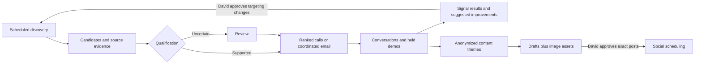

# Callie: five-part sales roadmap

Status: consolidated design draft, 5 October 2026. This combines David's interview decisions with proposed engineering defaults. It is not an implementation or activation report. Plan all five parts before executing them. David reports account-specific Google permission for the intended Gmail API use and confirms that his social accounts support reliable free scheduling. Use those as user-supplied planning inputs; the integrations still need implementation and end-to-end validation.

## The result

Give David a steady, useful queue of property managers to contact, with a defensible reason to call, coordinated follow-up, and evidence about what actually produces qualified demos. Then turn approved ideas and images into scheduled social posts.

David's choices: stronger leads into calls first, autonomous email next, social after that. Use AWS/GCP credits and existing free allowances; preserve the $25 additional monthly cash ceiling. No spending on X. Keep React, shadcn and Tailwind. Keep Today focused on action and put metrics elsewhere. No new paid database, mobile app, video pipeline or infrastructure rewrite.

A qualified demo is **held**, includes someone involved in buying, establishes a real maintenance-workflow need, and includes openness to paying. Booked, held and qualified are separate facts. There is no newly imposed door-count minimum, budget floor or buying deadline.

## Approach and boundaries

**Recommended: extend the existing app.** Reuse Postgres, the worker/job runner, CRM identities, budget reservations, send fencing, source retrieval and desktop components. Each capability is a focused module with its own settings and clear failure states. It does not need a separate service.

A paid sales/marketing suite would reduce some integration work but conflicts with the cash constraint. A general browser-agent platform would add session, recovery and verification work throughout the product. Use a narrow background browser adapter only where it is necessary and proven, particularly for free social scheduling; do not make the whole CRM depend on it.

Preserve the existing meeting capture, booking, notes/tasks and follow-through paths. This roadmap connects their evidence and outcomes instead of rebuilding them. Deals and exceptional commercial commitments remain David's. No outreach or paid processing is enabled by a planning document.

## 1. Verify continuous discovery

**Already shipped:** schema 49, desktop 1.0.44, candidate intake, source checks, monitoring and enabled bounded discovery. **Still unverified:** the first scheduled production search, persisted results and their desktop readback. Activation preserved the exhausted daily quota; enabling a switch is not an end-to-end result.

Read back one due run through search request, quota accounting, candidate persistence and Candidates. A genuine zero-result search is a valid execution result, but does not prove useful lead yield. Verify deduplication, retried jobs and visible quota/provider failures. Do not reset usage to manufacture a successful test.

Retain the deployed one-query-per-workspace-per-UTC-day default, at most five hits, and shared 20/day and 600/month request ceilings until measured yield supports a change. These are current configuration bounds, not a forecast of daily qualified leads. Separate search availability from known-source refresh so a search quota hold does not unnecessarily stop existing-source work.

**Done when:** a real scheduled run and its accounting are checked; actual returned candidates, if any, are visible and traceable. Record useful yield separately from runtime health.

## 2. Qualify firms using useful evidence

Use the existing [targeted sourcing design](2026-10-04-targeted-lead-sourcing-design.md) and [qualification/admission plan](../plans/2026-10-05-sourcing-qualification-admission.md) as inputs. The latter predates the request to plan all five parts and does not authorize starting implementation now.

Search both for explicit maintenance problems and for plausible residential managers who never publish their problems. Cover Texas and Providence/Boston, emphasizing scattered single-family portfolios while allowing other residential firms with a strong need. DFW Home's two-person team managing 200 doors is a useful hypothesis, not evidence that every small team is overloaded.

| Evidence | Initial treatment |
|---|---|
| Identified firm explicitly requests help with intake, coordination, vendor follow-up or after-hours coverage | Highest priority if current and relevant |
| Firm explicitly describes a matching operational burden | Eligible for priority after identity/contact checks |
| Coordinator vacancy or growth | Investigate; not sufficient alone to assert pain |
| Small team, portal technology, generic 24/7 claims or tenant reviews | Context and an opening question; need unconfirmed |
| Existing maintenance support | Contrary/contextual evidence; investigate a specific remaining gap |

The bounded fetcher supplies source text to Haiku through Bedrock. Store facts with source blocks and dates; a model proposes facts, while deterministic rules decide admission. Preserve unknowns and contradictory evidence. A source failure is not proof of missing staff, discontinued support or lost interest. Reuse existing limits, reservations and credit coverage checks; no direct Anthropic/OpenAI cash fallback.

Each result shows **why this firm**, **why now or timing unknown**, an opening question, and expandable evidence. It must not promise unbuilt integrations: AppFolio works today; Buildium or other support needs an accurate current product fact.

**Done when:** a real batch is reviewed for correct identities, contacts, source meaning and freshness; strong hypotheses and fit-only comparison results are reported honestly, including insufficient examples. Fix false automatic eligibility before enabling automatic admission. Valid JSON alone is not sufficient.

## 3. Put qualified leads into the work queue

Admit supported candidates directly without CSV handoffs. Uncertain candidates remain in Candidates for a short review. Keep the existing candidate identity distinct from a CRM firm until admission succeeds; clicking Keep is not permission to start outreach.

Admission rechecks duplicate identity, geography, ownership, stops, evidence freshness and one-active-contact-per-firm atomically. A shared franchise domain is not enough to merge firms. A published business main line is usable without inventing a person's name. Replays return the same result; they cannot create another contact, deal or enrollment.

Callbacks and commitments remain ahead of new leads. Rank new firms by supported need, freshness and reachability; show all admitted leads through pagination, not an arbitrary daily display cap. Actual dialing still enforces existing state/time/budget controls.

When autonomous email is ready, use the best leads for David's calls and let other qualified, email-reachable firms start email without waiting for a call. **Qualification for a phone call is not email eligibility.** Email-only candidates can remain reviewable before that delivery path is available.

**Done when:** a real admitted batch appears with the right evidence and ordering in the desktop; duplicate, stopped, ambiguous and stale candidates are handled correctly; navigation and retries preserve work.

## 4. Learn from conversations

Attach outcomes to the qualification, hypothesis, query and policy versions actually used. Count attempts, reached conversations, confirmed pain, booked demos, held qualified demos and customers separately. Wrong contact, existing satisfactory support, rejection and no answer are different observations.

Use transcript/meeting suggestions to reduce logging, with short correction actions. Don't make David complete a research form after every call. Preserve his corrections and manual deal decisions. Suggestions corrected later count as incorrect in the separate ten-call suggestion trial; sourcing evaluation does not silently activate suggestion application.

Show sample counts and denominators beside comparisons. Report confirmed pain per reached conversation, held qualified demos per contacted firm, useful-lead yield, correction rate and research cost. Keep multiple touches with one firm from inflating firm conversion. Tag the warm family introduction separately. Missing attribution stays unknown; do not claim a social impression caused a sale.

Initially recommend targeting/query/ranking changes with examples, counterexamples and sample size. David approves meaningful policy changes. Routine processing under the approved policy remains automatic. Small samples justify investigation, not automatic expansion or declaring a winning signal.

**Done when:** real call and meeting outcomes can be traced back to source evidence and policy versions, and corrections update reports without rewriting history. This reporting can ship before enough sales outcomes exist to judge conversion lift.

## 5a. Autonomous email and coordinated follow-up

**Confirmed product intent:** david@usecallie.com; no visible unsubscribe link; select firms and send within configured limits; automatically answer scheduling, straightforward product questions and approved pricing questions. Escalate discounts, unsupported claims, uncertain technical answers and unusual requests.

**Selected transport after David's clarification:** retain Gmail API and david@usecallie.com. On 5 October David stated that Google granted permission for the intended use and authorized proceeding under it. Record this as David-reported account-specific permission, not an independently verified Google approval or a change to Google's general published policies. No further provider search is needed for the draft. No mailbox purchase or SMTP migration is planned.

The existing code refuses cold prospecting both in sequence eligibility and at Gmail dispatch. The implementation must update both consistently for the explicitly configured workspace/mailbox, with an audited authorization record and tests that unconfigured mailboxes retain the refusal. Do not globally remove the guard, reclassify cold outreach as a requested follow-up, or backfill old cold enrollments as newly authorized. The exception concerns transport eligibility; domain pause, authentication, recipient stops, budgets, ramp limits, duplicate prevention and manual takeover still apply. This conversation updates the design, not live sending switches.

The application design can be specified independently: approved, versioned messaging and product facts; evidence-backed personalization; one firm/contact conversation plan; existing send fences and reconciliation. An uncertain provider result is reconciled before another send. Draft generation cannot lift a stop, authorize a sender or create a deal.

**Proposed combined-cadence default:** one unsolicited touch per firm per local day, no simultaneous phone/email sequences. Preserve the established maximum four unanswered calls over 14 days, voicemail on attempts 1 and 4. Start email with one introduction and two useful follow-ups over two weeks; timing is an experiment, not a research-proven optimum. An explicit requested callback/reply takes priority and replaces obsolete scheduled work. These email/combined defaults are proposals for the full plan, not claims about a previously approved template.

An inbound human reply immediately holds prospecting. Only supported routine responses can replace it; ambiguous intent goes to review. A booking ends obsolete prospecting and hands off to the existing meeting workflow. Recheck message/thread revision, direct-send takeover, stops and current eligibility at final dispatch. Honor the established phone-only, email-only and firm-wide stop semantics without adding a visible footer link against David's preference.

Warm the actual mailbox through gradual, consistent real sending, reserving capacity for follow-ups and replies. No synthetic engagement network. Read existing ramp configuration before choosing numbers; don't overwrite it with a generic vendor recommendation. Health includes bounces, provider deferrals, complaints when available and mailbox status. Missing Postmaster data is unknown, not a healthy score. SMTP acceptance is not proof of inbox placement. See [Google's sender guidance](https://support.google.com/mail/answer/81126?hl=en).

**Done when:** the configured Gmail transport eligibility works at both gates, one controlled end-to-end sequence/reply/booking flow works, stop/edit/takeover races are tested, and real accounting plus ambiguous-send recovery are verified. Domain activation remains a separate explicit action. Existing mailbox use and meeting follow-through can continue independently.

## 5b. Text and image social publishing

Destinations: David's LinkedIn and X profiles; Callie's Facebook Page. Draft material: approved product facts, public research and anonymized themes from calls/demos. No customer names, direct quotes, identifiable anecdotes or invented results. A composite theme is not presented as one real customer's story.

Formats: **text, product screenshots, web images and images from David's phone; no videos**. Start with file upload/paste and ordinary phone-to-Mac transfer. Keep originals, source links and per-platform derivatives; validate supported image types and sizes, normalize phone orientation, and remove location metadata from publication copies. Offer preview, crop and alt text. Product screenshots need a way to cover private data. Web images retain provenance; do not invent license/permission claims. This is a small asset library, not a mobile app or a general image editor.

Use one content workspace with drafts and a calendar. Suggest platform-specific variants rather than posting identical text everywhere. David approves the exact text, image version/crop, destination account and scheduled time. Substantive edits invalidate approval; moving a scheduled item is an explicit reschedule action with a readback. Do not publish from an unapproved regenerated draft.

Persist per-destination states: draft, approved, submitting, scheduled, published, cancellation-pending, cancelled, failed and unknown. Each destination has one submission identity and a provider receipt when available. If native scheduling owns publication, the CRM worker must not also publish at that time. A failed cancellation is not labelled cancelled; an uncertain submission is checked before retrying.

| Destination | Planned route | Verification still required |
|---|---|---|
| LinkedIn | Prefer accessible publishing API or native scheduling | Account/app access, current scopes, token expiry, receipts, edit/cancel behavior |
| Facebook Page | Prefer Page API or native Business Suite scheduling | Correct Page/account, permissions and verified scheduling/readback |
| X | Free native scheduling through a narrowly scoped background browser adapter | Durable scheduled receipt, cancellation and published readback; no paid API, Premium or scheduler fallback |

David confirms that his accounts support reliable free scheduling. Treat native scheduling availability as confirmed by him; the outstanding work is verifying our integration's schedule/readback/cancel flow, rather than asking him to establish availability again. [LinkedIn native scheduling](https://www.linkedin.com/help/linkedin/answer/a1347212), [LinkedIn publishing](https://learn.microsoft.com/en-us/linkedin/consumer/integrations/self-serve/share-on-linkedin) and [X scheduling](https://help.x.com/en/business-and-advertising/scheduled-tweets) remain technical references, not evidence that our adapter is already built. Facebook's Page API documentation was not retrievable in this research pass; native scheduling remains the selected fallback if API access adds unnecessary setup or expense.

For a browser adapter, isolate the task session, keep credentials out of logs, pause on expired login/challenges, and request sign-in without taking over the mouse or screen. Native platform scheduling is preferred so posts already scheduled do not depend on the Mac staying awake. If scheduling/readback cannot be verified at zero X cost, provide a clearly labelled draft handoff and report automatic X publishing as incomplete; do not quietly spend money or claim handoff equals automation.

The Codex browser is available for setup and investigation, not an assumed runtime dependency of Callie. The implementation plan must choose a narrow background browser runtime owned by the product, or a supported API, and account for session expiry and restarts. Prefer scheduling approved posts in advance; do not require a chat to wake up at every publication time.

**Done when:** each enabled destination can schedule an approved text/image post, read back its identity and content, cancel/reschedule reliably and confirm publication without duplicates. Verify with David-approved test content when setup begins. Show limitations by destination; one unavailable integration needn't block the others. No automated DMs, engagement bots, ads or video production in this scope.

## Delivery order and engineering checks

1. Verify the existing discovery release; do not rebuild it.
2. Implement evidence qualification and CRM admission together as the next useful release. Reuse the existing detailed plan after reconciling it with this document.
3. Add conversation attribution and lightweight learning reports. Collect outcome data while later work proceeds.
4. Implement the configured Gmail eligibility path, coordinated cold outreach and routine replies under David's reported account-specific permission.
5. Implement social assets/drafts/approvals, then verified delivery adapters using the free scheduling capability David confirmed. Check adapter behavior early so runtime requirements do not surprise us at the end.

Before execution, produce build steps covering all five parts, with file boundaries, migration needs, meaningful tests and dependencies. Keep external capability probes separate from production activation. Use existing release checks and one independent whole-branch review per release; no per-task review bureaucracy or release-system rebuild. Only required schema changes get migrations, assigned from current main at implementation time.

Across new code, test workspace isolation, duplicate jobs, stale results, concurrent corrections/stops, budget exhaustion and ambiguous provider responses. Verify the user flows in the real app after fixture tests. Published code, configured accounts and verified live operation are separate statuses.

## Remaining decisions versus engineering work

The interview has enough product direction for this overall design. The proposed combined cadence and image/approval behavior above need review with the full draft. Google permission and free native scheduling are now user-confirmed planning inputs, not repeated user questions. No credentials or purchase are needed just to finish the written plan.

Limit additional research to checks that could change the build:

1. **Useful lead yield and workload.** Measure unique reachable firms and evidence-qualified firms per search and per research run, with fit-only review cases separate. The deployed one-query/day setting is a pilot throttle, not a capacity plan for daily meetings. Compare observed queue inflow with David's calling capacity and the existing free search allowance before proposing higher frequency. No query-volume increase is authorized by this check. Use existing evaluation results first; collect further live evidence within the current accounting during validation.
2. **Coordinated outreach correctness.** Walk no-answer, callback, reply, opt-out, new booking, direct-send takeover and ambiguous-send scenarios across both channels. The current ramp is 5/10/15/25/35, then 50 messages per healthy sending-day bands, with separately controlled raises. These are application limits, not verified inbox-placement capacity. Derive new-prospect capacity after reserving follow-ups/replies instead of calling the whole cap a new-lead allowance. Confirm the qualified-demo representation separately from meeting attendance; current meeting states distinguish held/no-show but do not themselves prove commercial qualification.
3. **Free publishing adapter feasibility.** Verify one text/image draft through scheduling, receipt, rescheduling, cancellation and session recovery on each destination during the authorized integration probe. Select a product-owned background runtime and prevent duplicate submission after ambiguous outcomes. Native account capability is already confirmed; this check verifies our implementation, not David's claim.

Further generic cold-email, lead-generation or social-growth blog research is not a prerequisite. No study can establish which signal converts for Callie without its own observed outcomes. Keep proposed cadence and ranking choices testable and changeable.

Detailed interview answers and source limits are in [planning notes](../../sourcing/roadmap-planning-20261005.md). No product code, account settings, sending controls or social posts were changed for this draft.
